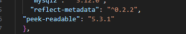

# 29/01/2025

- Test 2
- Introduction du projet et configuration de IceScrum (création de sprint et API token) pour avoir accès au dossier du projet.
- Problème avec le démarrage du projet, donc, en cherchant de solutions, j'ai trouvé grace à mon camarade Bastian. => J'ai supprimé node_module et package.jsonlock et j'ai modifié la version de la dependance peek-readdable pour la version 5.3.1 et j'ai reinstallé npm install.
  
- Resultat des test + suite
- Mauvaise manipulation sur github, je sais pas ce que j'ai fait (squash et trucs), je voulais modifier le temps d'un comit. Je fais ce comit pour dire que j'ai pris plus de temps sur le comit precedent
