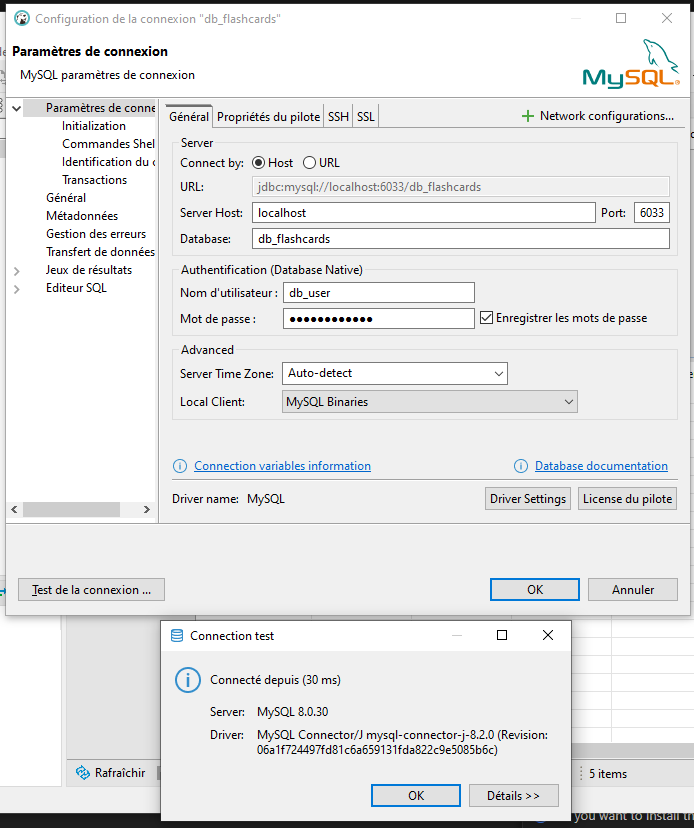

# FlashCards-GHE

Projet de Gonzalo Herrera pour P_Bulles 2

## Installation

### Logiciels requis

- NodeJs: v20.11.0
- npm: v10.2.4
- Docker Desktop: v4.10.0
- Docker Engine: v20.10.17

# 🚀 Procédure d'installation – FlashCards

Ce projet peut être mis en place de **deux manières différentes** :

---

## ✅ 1. Installation en local (Node.js + Docker)

La base de données MySQL sera lancée via Docker grâce à `docker-compose`.

👉 [Voir la procédure complète](./readme/installation-local.md)

---

## 🐳 2. Installation avec Docker (environnement isolé)

Cette méthode est recommandée pour une configuration rapide avec **Docker** et **Docker Compose**.

👉 [Voir la procédure complète](./readme/installation-dockerisation.md)

---

Une fois installé, l'application sera accessible ici :  
🔗 [http://localhost:3333](http://localhost:3333)

---

## ⚙️ Connexion à la base de données en développement

Pour gérer les données de la base de données MySQL en développement, nous recommandons d'utiliser **DBeaver** (ou tout autre client SQL de votre choix).

1. Lancez DBeaver ou votre client SQL.
2. Créez une nouvelle connexion :
   - **Type de base de données** : MySQL
   - **Hôte** : `localhost`
   - **Port** : `6033`
   - **Nom d'utilisateur** : `db_user`
   - **Mot de passe** : `db_user_pass`
   - **Base de données** : `db_flashcards`
3. Testez la connexion et enregistrez-la.
4. Vous pouvez maintenant explorer les tables et exécuter vos requêtes directement depuis DBeaver.

---
