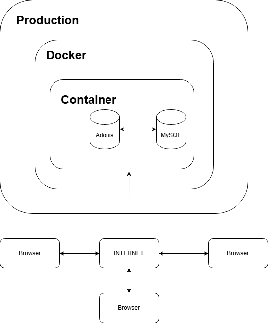
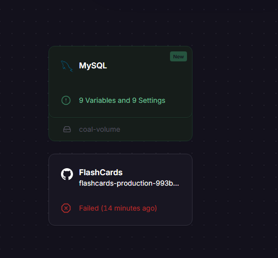
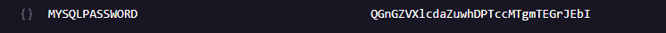
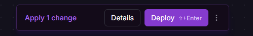
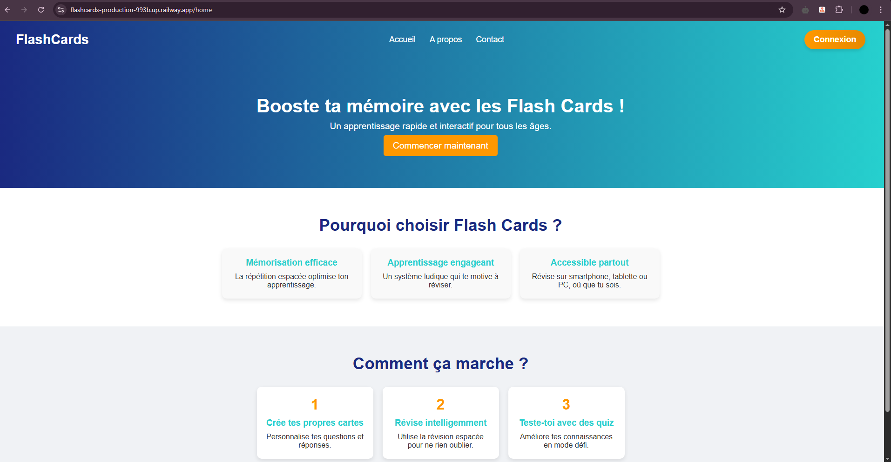
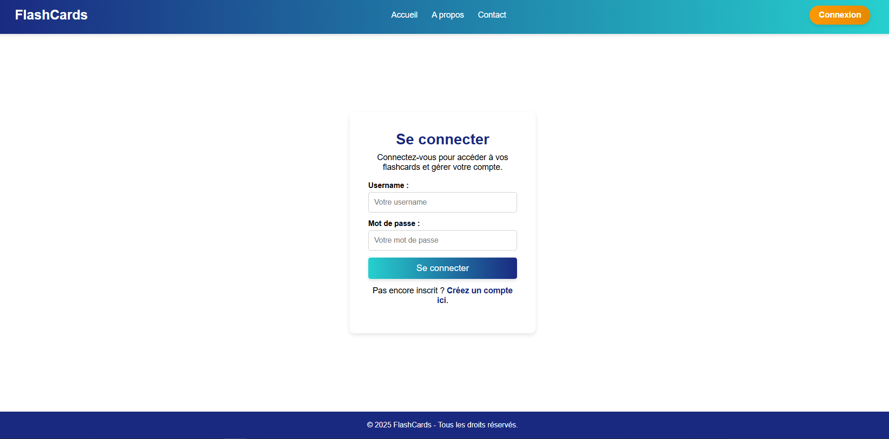
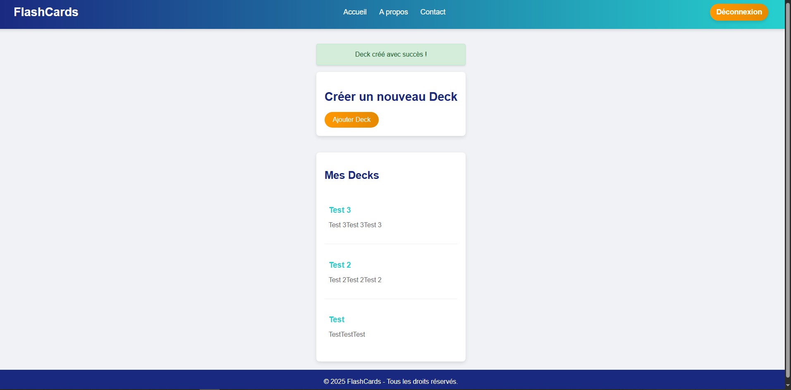

# 🚀 Déploiement de FlashCards sur Railway

Ce guide décrit comment déployer le projet **FlashCards** sur [Railway](https://railway.app), une plateforme cloud simple et efficace pour héberger des applications Node.js avec base de données intégrée.

---

## Schèma



## ✅ Pré-requis

- Un compte Railway : [https://railway.app](https://railway.app)
- Un dépôt Git du projet (sur GitHub)
- Projet FlashCards prêt à être publié (pas besoin de modifier de fichiers)

---

## 🧭 Étapes de déploiement

### 1. Connexion à Railway via GitHub

1. Va sur [https://railway.app](https://railway.app)
2. Clique sur **"New Project"**
3. Choisis **"Deploy from GitHub repo"**
4. Sélectionne ton dépôt `FlashCards`
5. Railway importe ton projet automatiquement

---

### 2. Configuration dans le container FlashCards

Une fois le projet importé

1. Clique sur ton projet -> Settings -> Networking -> Generate Domain -> Mettez le port `3333` -> `Generate Domain` -> **GARDEZ VOTRE URL**
2. Toujours en Settings -> Source -> `Add Root Directory` -> Mettez `flashcards` -> Confirmez
3. Toujours en Settings -> Deploy -> Custom Start Command -> + Start Command -> Mettez `node ace migration:run --force ` -> Confirmez

---

### 3. Ajouter la base de données

1. Fermez votre container Flashcards
2. Va dans l’onglet **"Create"**
3. Clique sur **"Database"** > **"Add MySQL"**
4. Railway génère automatiquement les identifiants MySQL (host, user, password, db). Ca prend 2-4 minutes normalement.

Photo de l'état des notre mise en production à ce point :



➡️ Récupère ces infos et ajoute-les dans l’onglet **"Variables"**. Suite de explication en bas.

---

### 4. Configuration des variables d’environnement

Toujours dans le container de FlashCards

1. Cliquez sur -> `Variables`
2. Ajoute les variables suivantes (clique sur `Raw Editor`) et copiez cela:

```
APP_KEY="hZ-9hxNODhk39kzzF3e1cwkDEXPQdypS"
DB_CONNECTION="mysql"
DB_DATABASE="railway"
DB_HOST="mysql.railway.internal"
DB_PORT="3306"
DB_USER="root"
HOST="0.0.0.0"
LOG_LEVEL="info"
NODE_ENV="production"
PORT="3333"
SESSION_DRIVER="cookie"
TZ="UTC"
DB_PASSWORD="ALLER CHERCHER"

```

- ⚠️ Tu peux garder cette `APP_KEY` ou la générer en local
- ⚠️ Pour obtenir ton \_`DB_PASSWORD` il faut aller dans le container de `MYSQL` et naviguer entre les variables et cherche ton MdP. Voici un exemple

  

3. Déployez votre application, les migrations seront lancées

   

---

### 4. Lancez votre application en production

1. Toujours en Settings (Flashcards) -> Deploy -> Custom Start Command -> + Start Command -> Supprimez `node ace migration:run --force ` -> Confirmez

2. Déployez votre application

   

## Votre application en production !

1. Page d'accueil

   

2. Page de login/création de compte

   

3. Page de decks

   

### 5. 🛡️ Recommendations finales

    - N’exécute qu’une seule fois node ace migration:run --force

    - Utilise un .env.production local pour tester avant de déployer

    - Active le HTTPS (fourni automatiquement par Railway)

    - Ne partage pas ton DB_PASSWORD
