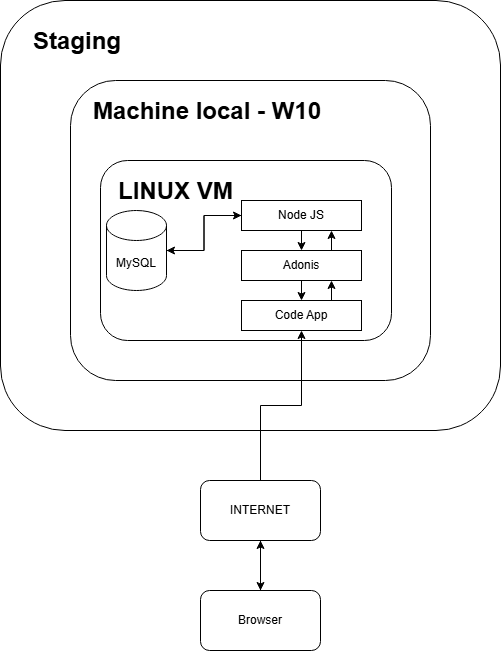

# 🌐 Environnement de staging – FlashCards

## Schèma

## ✅ Qu’est-ce que l’environnement de staging ?

L’environnement de **staging** est une **copie contrôlée de l’environnement de production** de l’application **FlashCards**, utilisée pour **tester les nouvelles fonctionnalités** avant leur mise en ligne officielle.

Il est destiné aux développeurs, testeurs, ou responsables produits pour :

- 🧪 Vérifier que tout fonctionne correctement
- 🚨 Identifier les bugs éventuels
- 🤝 Valider les modifications avant publication

---

## 🧱 À quoi il sert dans FlashCards ?

- Tester des **nouvelles fonctionnalités** comme le mode apprentissage ou la gestion des flashcards
- Valider les **modifications de la base de données** (migrations)
- Prévisualiser l’interface utilisateur avant qu’elle n’arrive en production
- S’assurer que l’intégration backend ↔ frontend fonctionne
- Effectuer des **tests de sécurité** ou de performance

---

## 🛠 Comment mettre en place un environnement de staging

Voici le lien de l'installation environnement de production

👉 [Voir la procédure complète](./readme/mise-en-production.md)

## ✅ Tableau de tests possibles en staging

| 📋 Fonctionnalité                | 🎯 Objectif du test                             | ✅ Résultat attendu                    |
| -------------------------------- | ----------------------------------------------- | -------------------------------------- |
| Création de compte utilisateur   | Vérifier que l'inscription fonctionne           | Redirection vers la page de login      |
| Connexion utilisateur            | Tester les identifiants valides/invalides       | Accès refusé si mauvais mot de passe   |
| Création de deck                 | Vérifier que l’on peut créer un nouveau deck    | Le deck apparaît sur la page d'accueil |
| Modification d’un deck           | Modifier le nom ou la description d’un deck     | Les infos sont mises à jour            |
| Suppression de deck              | Supprimer un deck existant                      | Le deck disparaît                      |
| Ajout de flashcards              | Créer une carte avec question/réponse           | La carte apparaît dans le deck         |
| Mode apprentissage               | Lancer une session et naviguer dans les cartes  | Affichage correct, progression suivie  |
| Statistiques d'apprentissage     | Réviser plusieurs cartes et terminer la session | Affichage des stats finales correct    |
| Affichage des erreurs            | Lancer une action non autorisée / vide          | Message d’erreur clair                 |
| Comportement responsive (mobile) | Tester l’UI sur différents écrans               | Affichage fluide, sans débordement     |
| Migration de base de données     | Ajouter une nouvelle colonne dans un modèle     | Aucune erreur, colonne bien appliquée  |
| Connexion à la base MySQL        | Tester accès MySQL avec les creds définis       | Connexion établie sans `Access Denied` |
| Chargement de la page d’accueil  | Vérifier les temps de chargement                | Inférieur à 2 secondes                 |

## 🧾 Conclusion

L’environnement de staging joue un rôle essentiel dans le cycle de vie de l’application FlashCards. Il permet de tester les fonctionnalités dans des conditions proches de la production, sans impacter les utilisateurs finaux.

- Grâce à cet environnement intermédiaire, tu peux :

        - Identifier les bugs plus tôt

        - Valider les évolutions avec l’équipe ou les parties prenantes

        - Gagner en confiance avant chaque déploiement en production

En mettant en place de bonnes pratiques (variables isolées, base dédiée, tests systématiques), l’environnement de staging devient un véritable filet de sécurité avant chaque mise en ligne.
